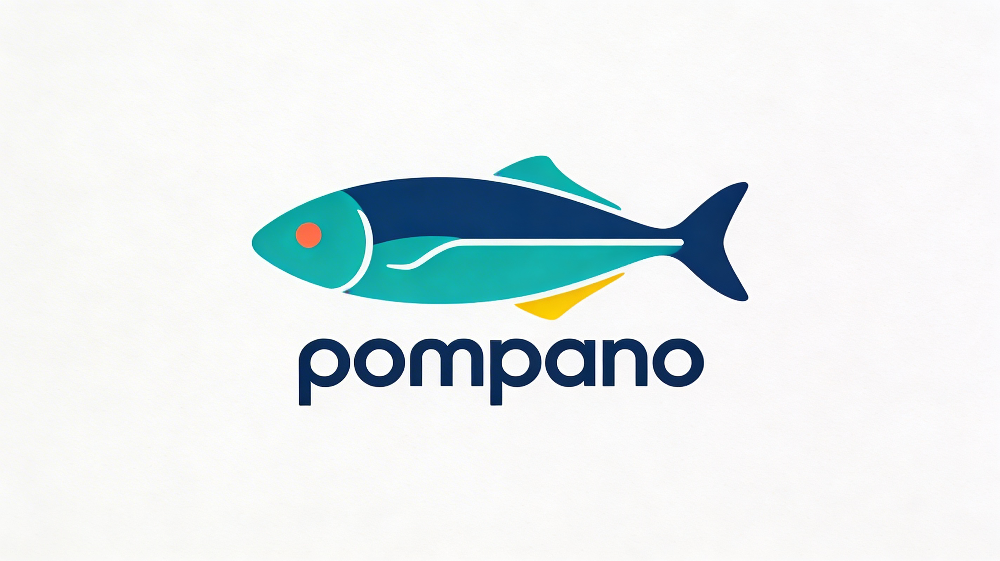

  

Pompano is a Java library for extracting structured content and metadata from web pages, syndication feeds, and other common content formats. It parses raw HTML, RSS, Atom, AMP, oEmbed, and more into clean, immutable model objects representing entries, authors, images, videos, and audio — ready for indexing, storage, or display.

The library handles the messy reality of web content: inconsistent metadata tags, protocol-relative URLs, varied date formats, embedded media in multiple locations, and the many ways publishers express authorship, titles, and summaries. It produces normalized, sanitized output from all of them.

## Supported Formats

**Feeds**
- RSS (all versions, including RDF-based RSS 1.0)
- Atom

**HTML**
- Full page metadata extraction (Open Graph, Twitter Cards, JSON-LD, meta tags, microdata)
- AMP (Accelerated Mobile Pages)
- oEmbed (JSON responses)

**Other**
- XML and text sitemaps
- EPUB e-books (with spine merging and content extraction)
- Twitter API JSON responses

A `UniversalParser` auto-detects the format and delegates to the appropriate parser.

## Key Features

- **Content cleaning and sanitization** — Configurable HTML safelists strip unsafe tags while preserving semantic structure. Handles iframes, embedded media, mailto links, and protocol-relative URLs.
- **Rich metadata extraction** — Pulls titles, summaries, authors, publish times, canonical links, and self-links from multiple sources with intelligent fallback ordering.
- **Media extraction** — Extracts images, videos, and audio from both page content and metadata (Open Graph, Twitter Cards, media RSS, enclosures), with dimensions and alt text.
- **Link extraction** — Discovers feed links, icon links, AMP links, external anchors, and citation URLs with deduplication and canonicalization.
- **Lenient date parsing** — Handles ISO 8601, RFC 822, and common variations with timezone support.
- **Immutable models** — All parsed output uses immutable objects with builder patterns.

## Documentation

- [Javadoc](https://attribyte.github.io/pompano/)

## License

Copyright 2026 [Attribyte Labs, LLC](https://attribyte.com)

Licensed under the [Apache License, Version 2.0](http://www.apache.org/licenses/LICENSE-2.0).
